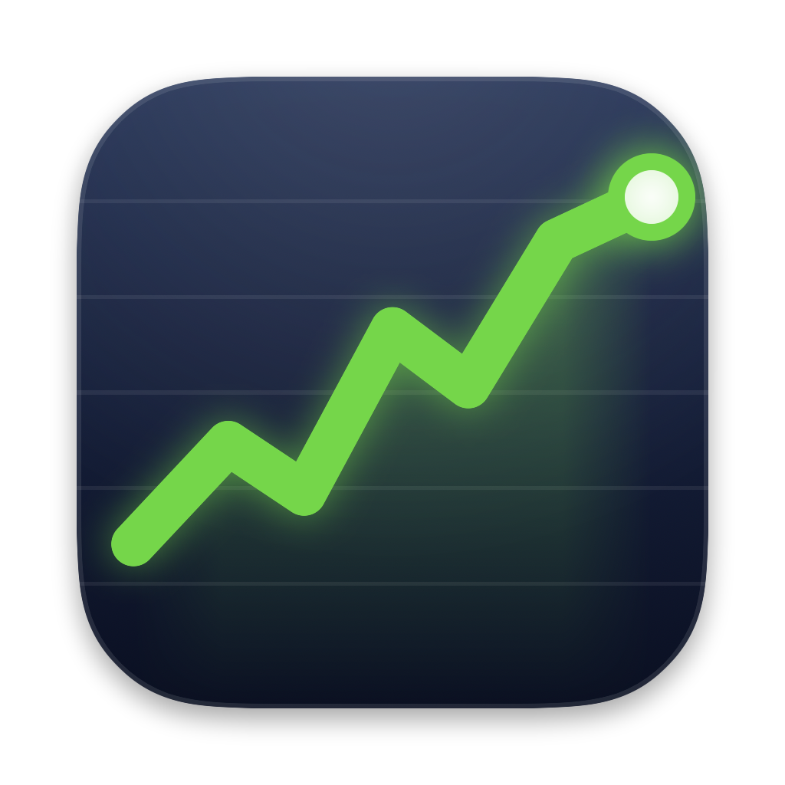

# Stock Ticker

A macOS menu bar app that shows live quotes in two compact rows, styled after the classic ticker look:

```
SPCX 2.60%     SPY 1.13%
$154.81 $3.93  $762.60 $8.55
```

- Text colours follow the menu bar's effective appearance, so the ticker stays legible on light and dark
  wallpapers (white/lime on dark bars, near-black/deep green on light bars; losses in red).
- Left-click opens a Liquid Glass panel (macOS 26+, material fallback below). Click the item again or
  press Esc to close it; right-click gives a quick menu. In the panel you can:
  - add **stocks**, **crypto** and **forex** pairs in their own rows, each with live suggestions
    (↑/↓ + Enter, or click). Suggestion indexes are cached weekly in
    `~/Library/Application Support/StockTicker/` (Alpaca assets, CoinMarketCap id map, ECB currencies).
  - reorder by dragging a chip — the others slide out of the way as you pass them
  - set the Alpaca and CoinMarketCap credentials, the refresh interval, and market-hours-only refreshing
  - show/hide the % change and the $ change in the bar, and hide cents from five-figure amounts
    (`$76,520` instead of `$76,520.29`; on by default)
  - choose gain/loss colours: **System** (Apple's green/red), **Dynamic** (vivid on dark menu bars,
    deep on light ones — the bar's appearance follows the wallpaper), a swatch, or a custom colour
- Data sources, one batched request each per refresh, cached across launches:
  - **Stocks/ETFs** — Alpaca Market Data snapshots (paper or live keys); change vs. previous close
  - **Crypto** — CoinMarketCap latest quotes by coin id (symbols aren't unique there); 24h change
  - **Forex** — Frankfurter (ECB reference rates, one fixing per working day); change vs. previous fixing,
    shown in the quote currency (`EUR/USD $1.1481`, `USD/JPY ¥155.69`)
  - Crypto and forex keep refreshing while the US stock market is closed.



## Build & run

Requires macOS 14+ and the Xcode Command Line Tools (Swift 6.4 was used).

```sh
./build.sh                 # -> build/StockTicker.app
open build/StockTicker.app
```

The app is menu-bar only (`LSUIElement`), so nothing appears in the Dock. Quit from the panel or the right-click menu.

> Using a menu bar manager (Bartender, Ice, Thaw, …)? New items usually land in its hidden section —
> ⌘-drag the ticker into the visible area once.

## Notes

- **API quotas**: Alpaca's free plan allows 200 requests/minute on the IEX feed (prices are IEX trades,
  not the consolidated tape). CoinMarketCap's free plan allows 10,000 credits/month — one credit per
  refresh regardless of coin count — so a 5-minute interval around the clock uses ~8,600. Frankfurter
  needs no key. Stock auto-refresh is limited to US market hours by default.
- **Credentials** are pre-filled in `TickerStore.swift` and stored in `UserDefaults` — fine for a
  personal build, but strip them before publishing the repo.
- **Toolchain**: the macOS 26+ SDK implements SwiftUI's `@State` as a compiler macro whose plugin ships
  only with Xcode, not the Command Line Tools. The panel keeps transient state in a small
  `ObservableObject` instead, and `build.sh` uses SwiftPM's native build system for the same reason.

## Layout

| File | Role |
|---|---|
| `Sources/StockTicker/StockTickerApp.swift` | Entry point (accessory app) |
| `Sources/StockTicker/AppDelegate.swift` | Wires store + status item, minimal Edit menu for ⌘C/⌘V |
| `Sources/StockTicker/TickerStore.swift` | Symbols, settings, cache, refresh loop |
| `Sources/StockTicker/Ticker.swift` | Stock / crypto / forex ticker model |
| `Sources/StockTicker/AlpacaClient.swift` | Stock snapshots (+ `QuoteError.swift`) |
| `Sources/StockTicker/CoinMarketCapClient.swift` | Crypto quotes by CoinMarketCap id |
| `Sources/StockTicker/FrankfurterClient.swift` | ECB forex rates with previous-fixing change |
| `Sources/StockTicker/SymbolDirectory.swift`, `CoinDirectory.swift`, `CurrencyDirectory.swift` | Cached indexes behind the suggestions |
| `Sources/StockTicker/TickerBarView.swift` | Two-row custom drawing in the status item |
| `Sources/StockTicker/StatusItemController.swift` | Status item, click routing, context menu |
| `Sources/StockTicker/TickerPanel.swift` | Borderless transparent panel + dismissal |
| `Sources/StockTicker/TickerPanelView.swift` | SwiftUI glass content |
| `scripts/make_icon.swift` | App icon drawn in SwiftUI; `scripts/make_icon.sh` regenerates `Resources/AppIcon.icns` |
